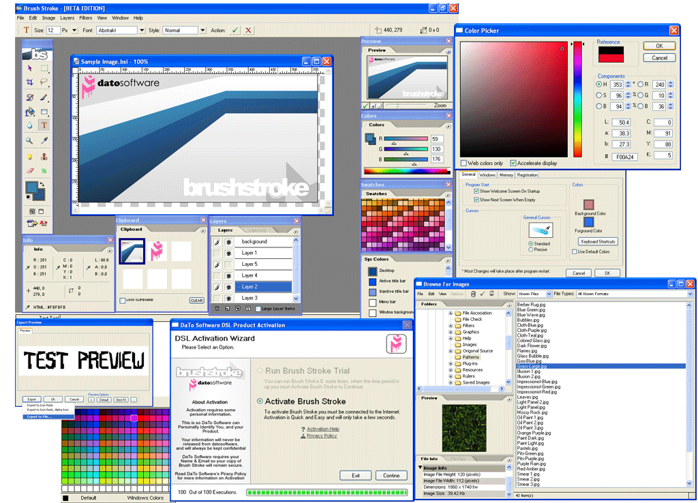

<div align="center">

## Brush Stroke 2\.4


</div>

### Description

Brush Stroke 2.4, the extreme Home Desktop Image Editing Standard, Created In Visual Basic, Brush Stroke has Come from one Extreme to the Other... Check out the Screen shot, and Review.

This Review is informing that Visual Basic Can be used, for the 'Professional' Side of things. If You would like to Help in this Project, please Contact us (Contact details in the Review).
 
### More Info
 


<span>             |<span>
---                |---
**Submitted On**   |
**By**             |[Dave Nedved](https://github.com/Planet-Source-Code/PSCIndex/blob/master/ByAuthor/dave-nedved.md)
**Level**          |Advanced
**User Rating**    |4.4 (31 globes from 7 users)
**Compatibility**  |VB 6\.0
**Category**       |[Graphics](https://github.com/Planet-Source-Code/PSCIndex/blob/master/ByCategory/graphics__1-46.md)
**World**          |[Visual Basic](https://github.com/Planet-Source-Code/PSCIndex/blob/master/ByWorld/visual-basic.md)
**Archive File**   |[](https://github.com/Planet-Source-Code/dave-nedved-brush-stroke-2-4__1-59994/archive/master.zip)


### Source Code

```
Brush Stroke 2.4, the professional image-editing standard and a major component of the digital imaging line, delivers more of what you crave. New creative tools help you achieve extraordinary results. Unprecedented adaptability lets you custom-fit Brush Stroke to the way you work, with many features. And with more efficient editing, processing, and file handling, as well as the new "B-Technology" there's no reason why not to have this powerfully imaging tool.
Brush Stroke 2.4 Now supports Custom Filters, and Plug ins. You can now "Feel at Home" with this powerful tool, allowing you to create Custom Workspaces, Swatches, Presets & Profiles, and even your own Printing Color Drivers.
There are many more features in Brush Stroke, Some of them are pictured in the Screen shot Above., download a Full Copy of Brush Stroke Today from: http://www.datosoftware.com/products/brushstroke/
Brush Stroke 2.4 Was programmed In Microsoft® Visual Basic®.
If you would like to be apart of this Project, in one or more of the Following Category's please Contact Us. Category's: Creating Filters, Plug ins, Extra Tools, Interface Improvement, Swatch Creation, Beta Testing, or if you have your own Ideas...
Contact David Nedved at: dnedved@datosoftware.com, or dnedved@gmail.com.
We would love your help.
If you have any comments or votes please leave them, but please only leave 'Respectful' comments...
Yours.
David Nedved - DaTo Software
Software Development Director.
```

